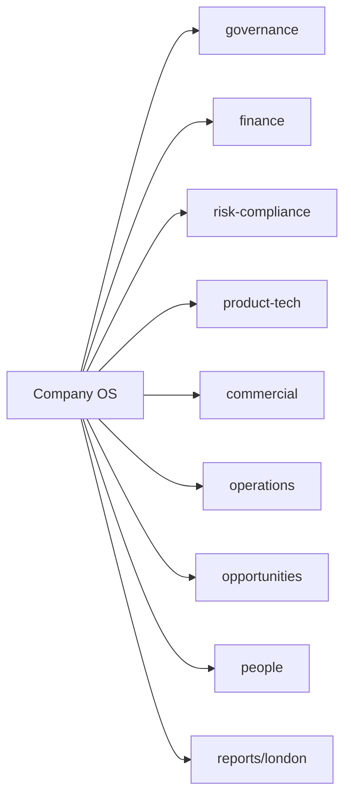

# Company OS

The control room of SambaPay. The Welcome Kit tells the story; this is the ledger. One README per area with purpose, owner, cadence and the registers that track it. Registers are living tables: edit them, do not rewrite them.

Owner of the whole OS: André Silva.

| Area | Purpose | Registers |
|---|---|---|
| [governance](governance/README.md) | Who decides what, what was decided, what London gets and when, the licensing roadmap, the ownership brief (board view) | `decision-log.md`, `licensing-roadmap.md`, `ownership-brief.md` |
| [finance](finance/README.md) | How the money works, breakeven, cash, the numbers London sees | `model.md` |
| [risk-compliance](risk-compliance/README.md) | Regulation, obligations, KYB stack, disputes | `obligations.md` |
| [product-tech](product-tech/README.md) | Payment engine, acquirer integrations, Website Factory | `integrations.md` |
| [commercial](commercial/README.md) | Pricing, pipeline, partners | `pipeline.md` |
| [operations](operations/README.md) | Merchant onboarding, operator windows, reconciliation, remittance | `merchant-onboarding.md`, `operator-windows.md` |
| [opportunities](opportunities/README.md) | Which markets and rails to open next | `latam-map.md` |
| [people](people/README.md) | The eight, their titles, the processes each one owns, the open seats, hiring | `process-map.md` |
| [reports/london](reports/london/) | Weekly pulse and monthly pack templates | `weekly-pulse.md`, `monthly-pack.md` |

## Cadence

- Every day: reconciliation first. Hansraj (PaySecure) confirms. SLA: Open.
- Every week: weekly pulse to London. Day: Open.
- Every month: monthly pack to London. Day: Open.
- Every objective in `welcome-kit/04-where-we-are-going.md` has an owner and a date here before it is called live.
